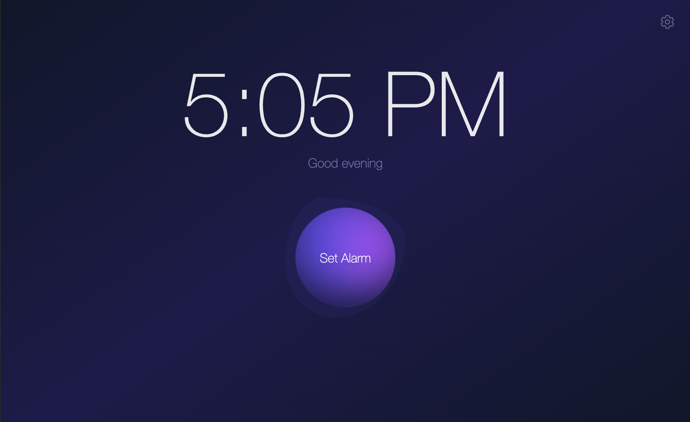
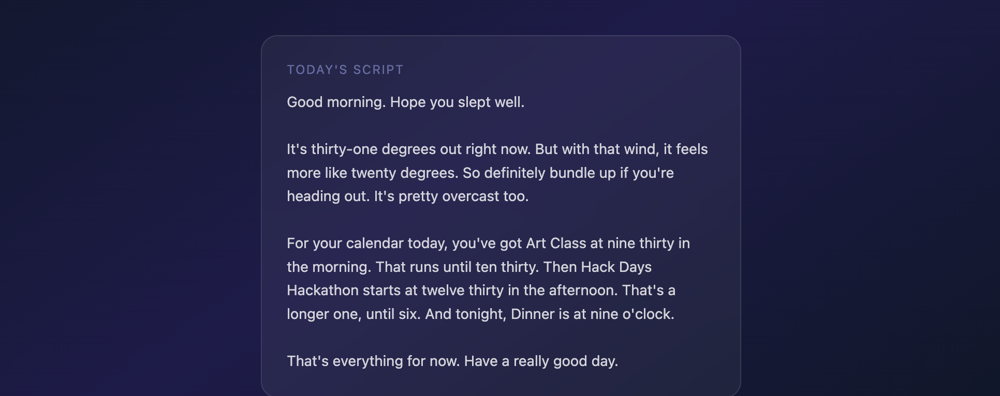

# Daybreak - Morning Brief Alarm

A personalized morning alarm that generates a spoken briefing with your weather and calendar events, backed by ambient music and nature sounds.

Set an alarm time, and the app pre-generates a ~30-second audio clip using your Google Calendar, local weather, and AI.






## How it works

1. **Set an alarm** via the scroll-wheel time picker
2. The app immediately fetches your **Google Calendar** events and **local weather**
3. **Google Gemini** writes a natural morning script informing you on your schedule and weather conditions
4. **ElevenLabs** generates text-to-speech audio plus nature sound effects
5. Everything is mixed with ambient music and weather-appropriate backing sounds (birds, rain, etc.)

## Setup

**Prerequisites:** Python 3.11+, [ffmpeg](https://ffmpeg.org/) (required by pydub)

```bash
# Clone and enter the project
git clone git@github.com:elisaliman/morning-alarm.git
cd morning-alarm

# Create a virtual environment and install dependencies
python -m venv .venv
source .venv/bin/activate
pip install -r requirements.txt

# Set up environment variables
cp .env.example .env
# Edit .env with your API keys (see below)

# Run the app
python main.py
```

Open [http://localhost:8000](http://localhost:8000) in your browser.

## API Keys

| Key | Where to get it |
|-----|----------------|
| `GEMINI_API_KEY` | [Google AI Studio](https://aistudio.google.com/apikey) |
| `ELEVENLABS_API_KEY` | [ElevenLabs Settings](https://elevenlabs.io/app/settings/api-keys) |

### Google Calendar

1. Create a project in the [Google Cloud Console](https://console.cloud.google.com/)
2. Enable the **Google Calendar API** and **People API**
3. Create an **OAuth 2.0 Client ID** (Desktop app type)
4. Download the credentials JSON and save it as `credentials.json` in the project root
5. On first use, the app opens a browser window to authorize your Google account

## Settings

Click the gear icon in the top-right corner to:

- **Location** — search and select your city for weather data
- **Google Calendar** — connect, switch, or disconnect your account
- **Cache** — clear today's cached audio to force a fresh generation

## Stack

- **Backend:** Python, FastAPI, pydub
- **Frontend:** Vanilla JS, Tailwind CSS
- **APIs:** Google Gemini, ElevenLabs (TTS + SFX), Google Calendar, Open-Meteo (weather)
